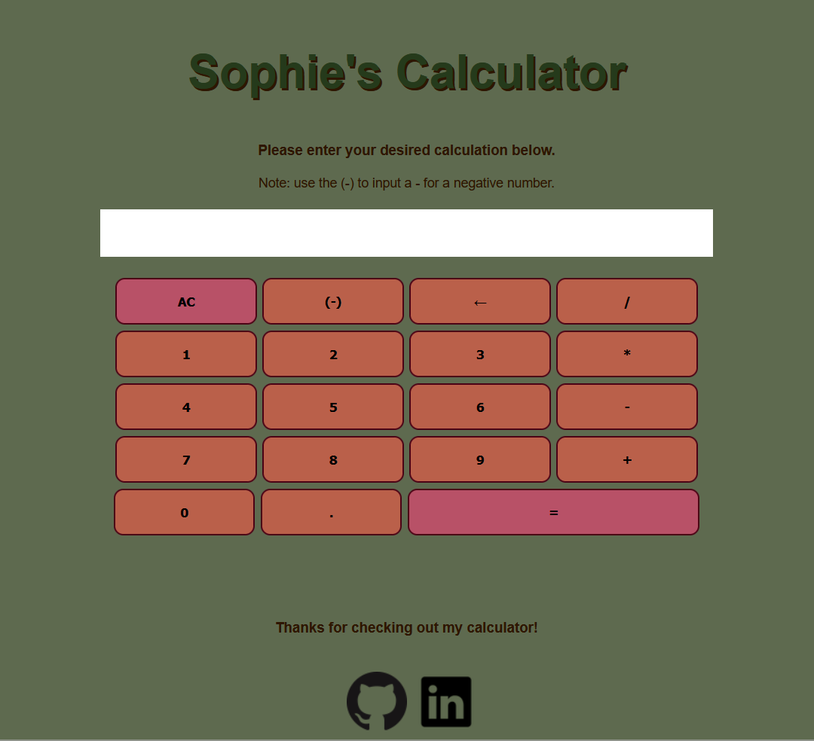

# Calculator

### A calculator project using JavaScript, HTML and SCSS.

## Styling and Design

I decided to base my calculator on this particular kids calculator as it seemed simple without being too antiquated or too boring. I removed the +- toggle and instead replaced it with the negative number (-) button.
https://kidssearch.com/KidsCalculator.html

My colour palettes for my websites are usually designed on Australian flora.
I used this colour palette based on a banksia. My portfolio project has a colour palette based on gum trees, and I wanted this to fit in with that with a similar theme without being too similar.
https://i.pinimg.com/originals/41/b2/e9/41b2e9f8680d4a23bfde778cdca1e865.jpg

## Dimensions and Screen Sizes

The minimum dimensions for this website are 250px width x 600px height.
This is well below the iPhone 11 Pro at 375x812 and the Galaxy S10 at 360x760.

## Updates from first attempt

The calculator now works with negative numbers, multiple variables and operators, and decimal places (including multiple decimals across variables). The AC(clear) and backspace buttons are also functional.

## How it works

All buttons are first defined in reference to the HTML to ensure it's a bit cleaner.

### exp:

exp is the variable that holds user input and is also the display. This is eventually the string that the calculate function is used on to return the result.

### numberButtons:

Whenever a number button is pressed, the value (as defined in the HTML) is added to the end of the exp string.

### buttonNegMinus:

Whenever (-) (the negative number button) is pressed, a - is added to exp if it's at the very start of exp (i.e. exp is an empty string), or immediately after an operator +, \* or /. I would like to add the -- in but I didn't quite have time before the submission of this project.

### operatorButtons:

Whenever any of the operator buttons are pressed: if the exp string is empty, nothing is added. If the most recent character is an operator or decimal, nothing happens. Otherwise (in the default case), the operator is added to the end of the exp string. This ensures you cannot have multiple operators in a row.

### buttonDec:

Whenever the decimal place button is clicked, it starts a while loop that ensures (using a switch statement) that, between the current position and either the start of the string or the most recent operator (depending on which comes first), there is no other decimal place.
If an operator or the start of exp is found before a decimal, the switch statement stops and sets variableStartReached to true(therefore the while loop also ends).
If there IS another decimal, then the switch statement stops and decAllowed is set to false (therefore the while loop also ends).
Once the switch statement and the loop are completed/broken, if decAllowed is still equal to true, a decimal point is added at the end of the exp string. Otherwise the exp string is returned.

### calculate:

This is a function that takes in a string and searches for the first iterance of: the \* or / operator first, then the - or + operator. If it finds an operator after the first position, ii creates substrings. The first is the string before the operator, the second is the operator, and the third is the string after the operator (which can include more operators.) It then feeds these three values into a later function (calculateHelper), where a = the first, o = the second (the operator identified by the search) and b = the third. Since a or b may contain further operators, the helper function then calls this function again on each a and b. This is repeated until no further operators are found, when string is returned.

### calculateHelper:

defined above, enacts the operators on the variables defined in calculate. Refers the resultant variables back to the calculate, where they can be reprocessed and returned to calculateHelper if further operators are found.

### buttonEquals:

when equals is clicked:
if the last value in the string exp is an operator or a decimal, nothing happens.
Otherwise, it returns the calculate function enacted on exp.

### buttonClr:

clears exp.

### buttonBsp:

removes the last character from the exp string.

### buttons:

refreshes the display with the updated contents of exp every time any button other than decButton is pressed. This ensures the display stays up to date without lagging behind an input.

## Things I would work on with more time

-   order of operations(currently works +- and then \*/ and then right to left, which is the opposite of what is ideal, but wasn't necessary for MVP)
-   being able to place a minus and then a negative number operator (i.e. 1--1 = 2).
-   incorporating brackets
-   incorporating power of
-   incorporating memory
